# Data Flow Diagram - Level 0 (Context Diagram)

This diagram shows the high-level context of the AI Meeting Assistant system, illustrating the main process, external entities, and data flows.

## Legend

-   **External Entities** (Rectangles): Sources or destinations of data outside the system
-   **Process** (Circle): The core system/application
-   **Data Store** (Open Rectangle): Database storage
-   **Data Flows** (Arrows): Movement of information

---

## Level 0 DFD

```mermaid
graph TB
    %% External Entities - using subgraph for box styling
    User[👤 User<br/>Authenticated User]
    Guest[👥 Guest User<br/>Meeting Participant]
    EmailSys[📧 Email System<br/>Resend]
    StreamAPI[🎥 Stream API<br/>Video & Chat]
    OpenAI[🤖 OpenAI API<br/>GPT & Embeddings]

    %% Main Process - circular process
    System((AI Meeting<br/>Assistant<br/>System))

    %% Data Store
    DB[(Database<br/>PostgreSQL)]

    %% Data Flows from User
    User -->|User Credentials| System
    User -->|Create/Manage Agents| System
    User -->|Schedule Meetings| System
    User -->|Upload Documents| System
    User -->|Join Meeting| System
    User -->|Send Chat Messages| System

    System -->|Authentication Status| User
    System -->|Agent List| User
    System -->|Meeting List| User
    System -->|Meeting Summary| User
    System -->|Transcript| User

    %% Data Flows from Guest User
    Guest -->|Guest Name| System
    Guest -->|Join Meeting Request| System
    System -->|Meeting Access Token| Guest
    System -->|Meeting Stream| Guest

    %% Data Flows with Email System
    System -->|Meeting Invitations| EmailSys
    EmailSys -->|Delivery Status| System

    %% Data Flows with Stream API
    System -->|Create Call/Channel| StreamAPI
    System -->|User Tokens| StreamAPI
    StreamAPI -->|Webhook Events| System
    StreamAPI -->|Transcript URL| System
    StreamAPI -->|Recording URL| System

    %% Data Flows with OpenAI
    System -->|Agent Instructions| OpenAI
    System -->|Document Text| OpenAI
    System -->|Chat Context| OpenAI
    OpenAI -->|AI Responses| System
    OpenAI -->|Text Embeddings| System
    OpenAI -->|Meeting Summary| System

    %% Data Flows with Database
    System -->|Store User Data| DB
    System -->|Store Agents| DB
    System -->|Store Meetings| DB
    System -->|Store Documents| DB
    System -->|Store Embeddings| DB

    DB -->|Retrieve User Data| System
    DB -->|Retrieve Agents| System
    DB -->|Retrieve Meetings| System
    DB -->|Retrieve Documents| System
    DB -->|Query Embeddings| System

    %% Styling
    classDef entityStyle fill:#e1f5ff,stroke:#0288d1,stroke-width:3px,color:#000
    classDef processStyle fill:#fff9c4,stroke:#f57f17,stroke-width:4px,color:#000
    classDef datastoreStyle fill:#f3e5f5,stroke:#7b1fa2,stroke-width:3px,color:#000

    class User,Guest,EmailSys,StreamAPI,OpenAI entityStyle
    class System processStyle
    class DB datastoreStyle
```

---

## Core Data Flows Explained

### 1. User Authentication & Management

-   **Input**: User credentials, agent configurations, meeting schedules
-   **Output**: Authentication status, agent listings, meeting details
-   **Purpose**: Manage user accounts and their AI agents

### 2. Meeting Creation & Participation

-   **Input**: Meeting details, participant names, join requests
-   **Output**: Meeting tokens, video/audio streams, access permissions
-   **Purpose**: Enable users and guests to participate in AI-assisted meetings

### 3. Document Knowledge Base (RAG)

-   **Input**: PDF documents from users
-   **Output**: Processed embeddings, enhanced agent knowledge
-   **Purpose**: Enable AI agents to reference uploaded documentation

### 4. Real-time AI Interaction

-   **Input**: User audio/text during meetings
-   **Output**: AI agent responses, suggestions, summaries
-   **Purpose**: Provide intelligent meeting assistance

### 5. Post-Meeting Processing

-   **Input**: Meeting transcripts and recordings from Stream API
-   **Output**: AI-generated summaries, searchable transcripts
-   **Purpose**: Create valuable meeting artifacts

### 6. Invitation System

-   **Input**: Recipient emails, meeting schedules
-   **Output**: Email invitations with calendar events
-   **Purpose**: Facilitate meeting participant coordination

---

## System Components Overview

### External Entities

| Entity           | Description                                                    | Data Exchange                                             |
| ---------------- | -------------------------------------------------------------- | --------------------------------------------------------- |
| **User**         | Authenticated system users who create agents and host meetings | Bidirectional: Credentials, agent configs, meeting data   |
| **Guest User**   | Non-authenticated participants joining via invitation links    | Limited: Name, meeting access only                        |
| **Email System** | Resend service for sending meeting invitations                 | Outbound: Invitations with calendar attachments           |
| **Stream API**   | Video/chat infrastructure provider                             | Bidirectional: Call management, webhooks, media URLs      |
| **OpenAI API**   | AI model provider for agent intelligence                       | Bidirectional: Instructions/context, responses/embeddings |

### Central Process

**AI Meeting Assistant System**: Core application handling user management, agent configuration, meeting orchestration, RAG processing, and real-time AI interactions.

### Data Store

**PostgreSQL Database**: Persistent storage for users, agents, meetings, guest records, documents, and vector embeddings for semantic search.

---

## Key Features Highlighted

1. **Multi-User Support**: Both authenticated users and guests can participate
2. **AI Agent Customization**: Users create and configure AI agents with custom instructions
3. **Knowledge Base Integration**: RAG system enables agents to reference uploaded documents
4. **Real-time Collaboration**: Live video meetings with AI participation
5. **Automated Documentation**: AI-generated summaries and searchable transcripts
6. **Invitation Management**: Calendar-integrated email invitations

---

_Last Updated: January 15, 2026_
