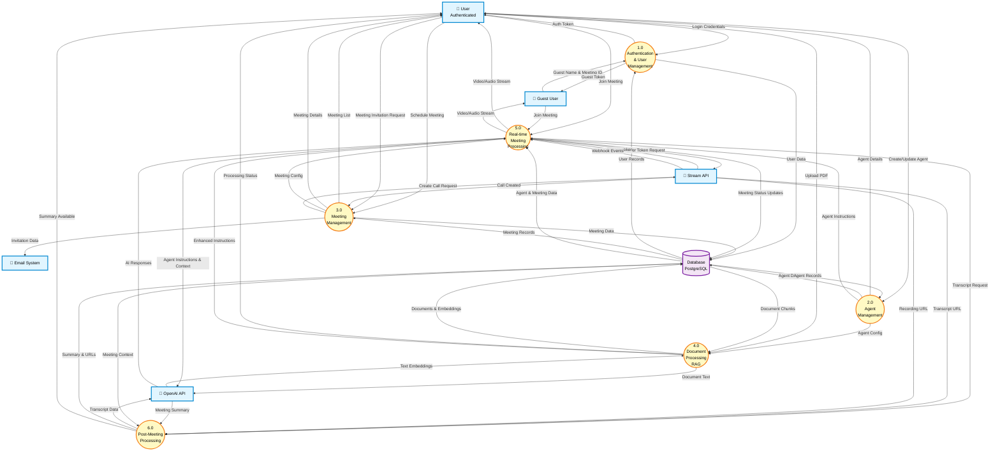

# Data Flow Diagram - Level 1

This diagram breaks down the AI Meeting Assistant system into its core functional processes, showing detailed data flows between processes, external entities, and data stores.

## Legend

-   **External Entities** (Rectangles): Sources or destinations of data outside the system
-   **Processes** (Circles): Core functional modules within the system
-   **Data Store** (Open Rectangle): Database storage
-   **Data Flows** (Arrows): Movement of information

---

## Level 1 DFD

---

## Process Descriptions

### 1.0 - Authentication & User Management

**Purpose**: Handle user authentication, session management, and guest user creation

**Inputs**:

-   User login credentials
-   Guest name and meeting ID

**Outputs**:

-   Authentication tokens
-   Guest access tokens
-   Session data

**Key Operations**:

-   Validate user credentials
-   Create and manage sessions
-   Generate guest user records
-   Issue authentication tokens

---

### 2.0 - Agent Management

**Purpose**: Create, configure, and manage AI agents with custom instructions

**Inputs**:

-   Agent name and instructions
-   GitHub repository links
-   Update requests

**Outputs**:

-   Agent details and listings
-   Agent configurations for other processes

**Key Operations**:

-   Create new agents
-   Update agent instructions
-   Delete agents and cascade to related data
-   Retrieve agent information
-   Provide agent config to meeting and RAG processes

---

### 3.0 - Meeting Management

**Purpose**: Schedule, configure, and coordinate meetings

**Inputs**:

-   Meeting name and schedule
-   Selected agent
-   Invitation recipient emails

**Outputs**:

-   Meeting details and listings
-   Email invitations
-   Stream call configurations

**Key Operations**:

-   Create meeting records
-   Link meetings with agents
-   Send email invitations with calendar events
-   Initialize Stream video calls
-   Update meeting status
-   Provide meeting config to real-time process

---

### 4.0 - Document Processing (RAG)

**Purpose**: Process PDF documents and create searchable knowledge base for agents

**Inputs**:

-   PDF documents from users
-   Agent ID for association

**Outputs**:

-   Processed document metadata
-   Text embeddings
-   Enhanced agent instructions
-   Processing status

**Key Operations**:

-   Extract text from PDFs
-   Split text into chunks
-   Generate embeddings via OpenAI
-   Store chunks with embeddings
-   Provide knowledge context to agents
-   Enable semantic search

---

### 5.0 - Real-time Meeting Processing

**Purpose**: Orchestrate live meetings with AI agent participation

**Inputs**:

-   Join requests from users/guests
-   Agent instructions from Process 2.0
-   Enhanced instructions from Process 4.0
-   Meeting configuration from Process 3.0
-   Audio/video streams
-   Webhook events from Stream

**Outputs**:

-   Video/audio streams to participants
-   AI responses and interactions
-   Meeting status updates
-   Transcript generation trigger

**Key Operations**:

-   Manage participant connections
-   Stream video/audio
-   Connect AI agent to call
-   Process real-time AI interactions
-   Handle meeting state transitions
-   Monitor webhook events
-   Trigger post-meeting processing

---

### 6.0 - Post-Meeting Processing

**Purpose**: Generate summaries and finalize meeting artifacts

**Inputs**:

-   Transcript URL from Stream
-   Recording URL from Stream
-   Meeting context from database

**Outputs**:

-   AI-generated meeting summary
-   Stored transcript and recording URLs
-   Completion notifications

**Key Operations**:

-   Fetch and parse transcripts
-   Identify speakers
-   Generate AI summaries
-   Update meeting records
-   Mark meetings as completed
-   Enable post-meeting chat with context

---

## Data Flows Between Processes

### Agent → Meeting

-   Agent configurations flow to meeting setup
-   Agent instructions guide meeting behavior

### Agent → Document Processing

-   Agent ID links documents to specific agents
-   Documents enhance agent knowledge

### Document Processing → Real-time Meeting

-   Enhanced instructions with RAG context
-   Knowledge base access during meetings

### Meeting → Real-time Processing

-   Meeting configuration and participants
-   Agent selection and settings

### Real-time Processing → Post-Meeting

-   Trigger for summary generation
-   Meeting completion signals

---

## Data Store Operations

### Authentication Process (1.0)

-   **Store**: User sessions, guest user records
-   **Retrieve**: User credentials, session validation

### Agent Management (2.0)

-   **Store**: Agent profiles, instructions, GitHub repos
-   **Retrieve**: Agent details, agent listings
-   **Delete**: Agents (cascades to meetings and documents)

### Meeting Management (3.0)

-   **Store**: Meeting schedules, statuses, participant links
-   **Retrieve**: Meeting details, agent associations
-   **Delete**: Meetings (cascades to guest users)

### Document Processing (4.0)

-   **Store**: Document metadata, text chunks, embeddings
-   **Retrieve**: Document chunks for semantic search

### Real-time Processing (5.0)

-   **Update**: Meeting status (upcoming → active → processing)
-   **Retrieve**: Agent instructions, meeting data

### Post-Meeting Processing (6.0)

-   **Update**: Meeting summaries, transcript URLs, recording URLs
-   **Update**: Meeting status (processing → completed)
-   **Retrieve**: Meeting and agent data for context

---

## External Entity Interactions

### User

-   Interacts with: Processes 1.0, 2.0, 3.0, 4.0, 5.0, 6.0
-   Primary actions: Authentication, agent creation, meeting scheduling, document upload, meeting participation

### Guest User

-   Interacts with: Processes 1.0, 5.0
-   Limited actions: Guest registration, meeting participation only

### Email System

-   Interacts with: Process 3.0
-   Purpose: Send meeting invitations with calendar attachments

### Stream API

-   Interacts with: Processes 3.0, 5.0, 6.0
-   Purpose: Video infrastructure, webhooks, media URLs

### OpenAI API

-   Interacts with: Processes 4.0, 5.0, 6.0
-   Purpose: Embeddings generation, real-time AI responses, summary generation

---

_Last Updated: January 15, 2026_
