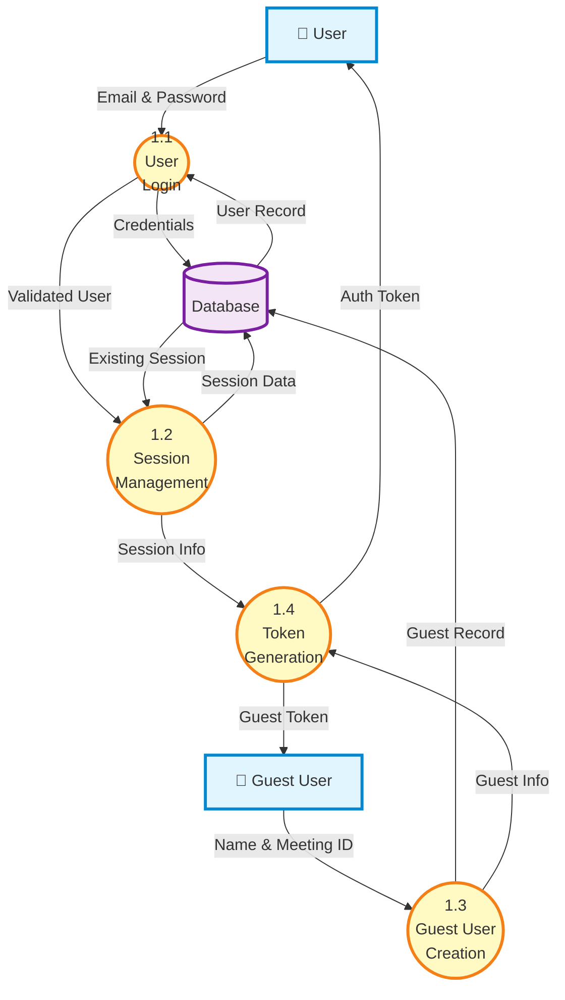
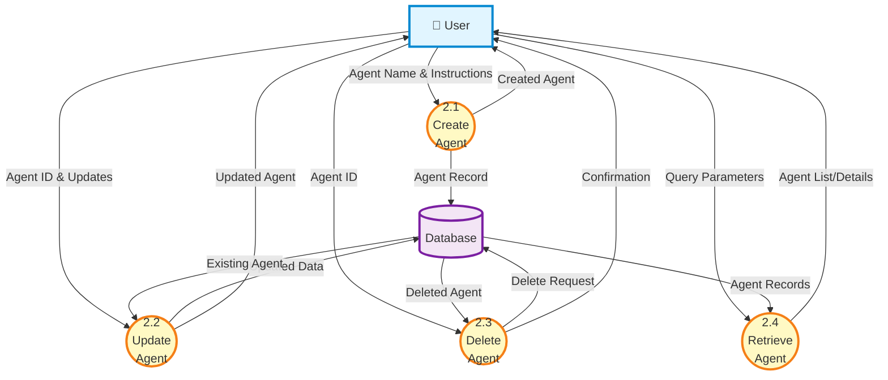
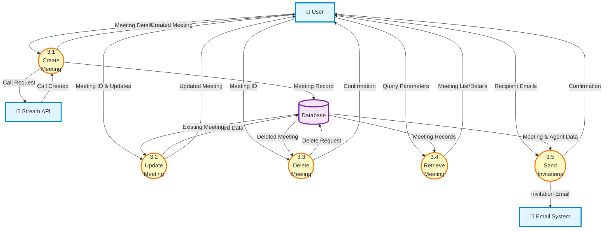
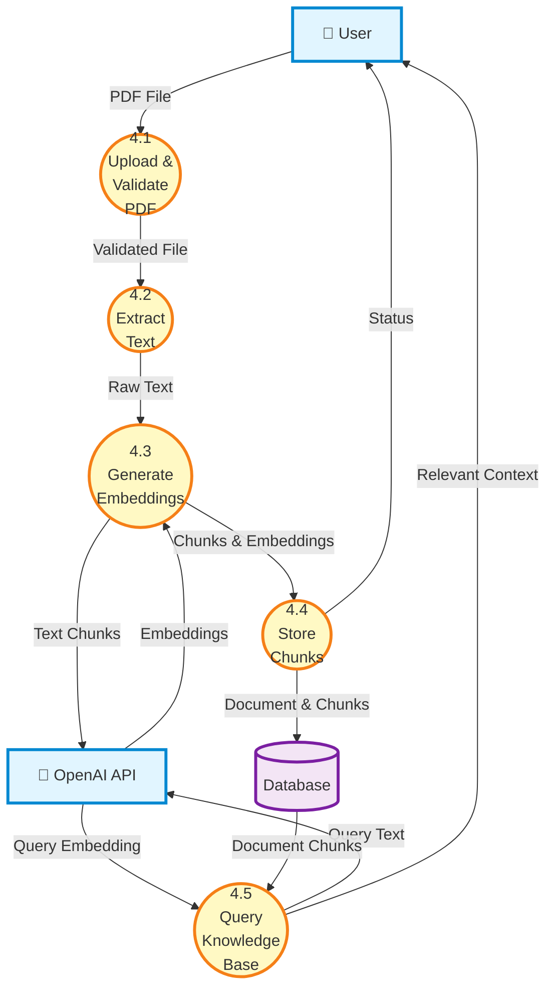
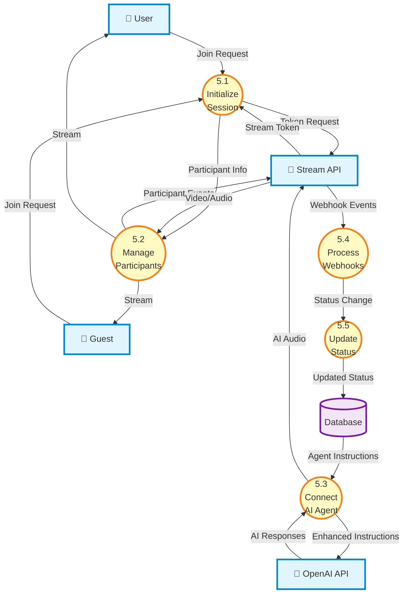
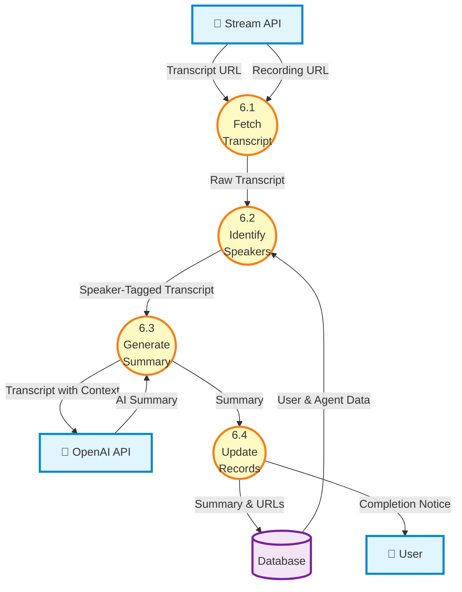

# Data Flow Diagram - Level 2

This diagram provides detailed breakdowns of each Level 1 process into sub-processes, showing the internal operations and data flows within each major functional area.

---

## 1.0 - Authentication & User Management (Level 2)



### Sub-processes:

-   **1.1 User Login**: Validate user credentials against database
-   **1.2 Session Management**: Create and track user sessions
-   **1.3 Guest User Creation**: Register guest participants for meetings
-   **1.4 Token Generation**: Generate JWT tokens for authenticated access

---

## 2.0 - Agent Management (Level 2)



### Sub-processes:

-   **2.1 Create Agent**: Insert new agent with custom instructions
-   **2.2 Update Agent**: Modify existing agent properties
-   **2.3 Delete Agent**: Remove agent and cascade delete related data
-   **2.4 Retrieve Agent**: Fetch single agent or paginated list with search

---

## 3.0 - Meeting Management (Level 2)



### Sub-processes:

-   **3.1 Create Meeting**: Create meeting record and initialize Stream call
-   **3.2 Update Meeting**: Modify meeting properties (name, agent, status)
-   **3.3 Delete Meeting**: Remove meeting and associated guest users
-   **3.4 Retrieve Meeting**: Fetch meetings with filters and pagination
-   **3.5 Send Invitations**: Email invitations with calendar events to participants

---

## 4.0 - Document Processing / RAG (Level 2)



### Sub-processes:

-   **4.1 Upload & Validate PDF**: Accept PDF files and verify format/size
-   **4.2 Extract Text**: Parse PDF and extract text content
-   **4.3 Generate Embeddings**: Split text into chunks and generate vector embeddings
-   **4.4 Store Chunks**: Save document metadata and chunks with embeddings
-   **4.5 Query Knowledge Base**: Perform semantic search using cosine similarity

---

## 5.0 - Real-time Meeting Processing (Level 2)



### Sub-processes:

-   **5.1 Initialize Session**: Set up Stream call and generate participant tokens
-   **5.2 Manage Participants**: Handle join/leave events and stream video/audio
-   **5.3 Connect AI Agent**: Integrate OpenAI real-time agent into the call
-   **5.4 Process Webhooks**: Handle Stream webhook events (start, end, participant changes)
-   **5.5 Update Status**: Update meeting status (upcoming → active → processing)

---

## 6.0 - Post-Meeting Processing (Level 2)



### Sub-processes:

-   **6.1 Fetch Transcript**: Retrieve transcript and recording URLs from Stream webhook
-   **6.2 Identify Speakers**: Match speaker IDs with user, agent, and guest records
-   **6.3 Generate Summary**: Use OpenAI to create structured meeting summary
-   **6.4 Update Records**: Save summary, URLs, and mark meeting as completed

---

## Process Details Summary

### 1.0 Authentication & User Management

| Process                 | Input            | Output         | Data Store Operations |
| ----------------------- | ---------------- | -------------- | --------------------- |
| 1.1 User Login          | Email, Password  | Validated User | SELECT user           |
| 1.2 Session Management  | User ID          | Session Info   | INSERT/SELECT session |
| 1.3 Guest User Creation | Name, Meeting ID | Guest Record   | INSERT guestUsers     |
| 1.4 Token Generation    | User/Guest Info  | JWT Token      | None (in-memory)      |

### 2.0 Agent Management

| Process            | Input              | Output        | Data Store Operations   |
| ------------------ | ------------------ | ------------- | ----------------------- |
| 2.1 Create Agent   | Name, Instructions | Agent Record  | INSERT agents           |
| 2.2 Update Agent   | Agent ID, Updates  | Updated Agent | UPDATE agents           |
| 2.3 Delete Agent   | Agent ID           | Confirmation  | DELETE agents (cascade) |
| 2.4 Retrieve Agent | Search, Pagination | Agent List    | SELECT agents           |

### 3.0 Meeting Management

| Process              | Input               | Output          | Data Store Operations     |
| -------------------- | ------------------- | --------------- | ------------------------- |
| 3.1 Create Meeting   | Name, Agent ID      | Meeting Record  | INSERT meetings           |
| 3.2 Update Meeting   | Meeting ID, Updates | Updated Meeting | UPDATE meetings           |
| 3.3 Delete Meeting   | Meeting ID          | Confirmation    | DELETE meetings (cascade) |
| 3.4 Retrieve Meeting | Filters, Pagination | Meeting List    | SELECT meetings + agents  |
| 3.5 Send Invitations | Emails, Meeting ID  | Email Sent      | SELECT meetings + agents  |

### 4.0 Document Processing (RAG)

| Process                  | Input               | Output           | Data Store Operations                  |
| ------------------------ | ------------------- | ---------------- | -------------------------------------- |
| 4.1 Upload & Validate    | PDF File            | Validated Buffer | None                                   |
| 4.2 Extract Text         | PDF Buffer          | Raw Text         | None (processing)                      |
| 4.3 Generate Embeddings  | Text Chunks         | Embeddings       | None (API call)                        |
| 4.4 Store Chunks         | Chunks + Embeddings | Document ID      | INSERT agentDocuments + documentChunks |
| 4.5 Query Knowledge Base | Query String        | Relevant Chunks  | SELECT documentChunks (vector search)  |

### 5.0 Real-time Meeting Processing

| Process                 | Input              | Output             | Data Store Operations                |
| ----------------------- | ------------------ | ------------------ | ------------------------------------ |
| 5.1 Initialize Session  | Join Request       | Stream Token       | SELECT meetings + agents             |
| 5.2 Manage Participants | Participant Events | Video/Audio Stream | None (Stream API)                    |
| 5.3 Connect AI Agent    | Agent Instructions | AI Responses       | SELECT agents (for instructions)     |
| 5.4 Process Webhooks    | Webhook Payload    | Event Handled      | None (event processing)              |
| 5.5 Update Status       | Status Change      | Updated Meeting    | UPDATE meetings (status, timestamps) |

### 6.0 Post-Meeting Processing

| Process               | Input         | Output            | Data Store Operations              |
| --------------------- | ------------- | ----------------- | ---------------------------------- |
| 6.1 Fetch Transcript  | Webhook Event | Transcript Data   | UPDATE meetings (URLs)             |
| 6.2 Identify Speakers | Speaker IDs   | Tagged Transcript | SELECT users + agents + guestUsers |
| 6.3 Generate Summary  | Transcript    | AI Summary        | None (API call)                    |
| 6.4 Update Records    | Summary       | Completion        | UPDATE meetings (summary, status)  |

---

## Key Data Transformations

### Authentication Flow (1.0)

```
User Credentials → Validated User → Session → JWT Token
```

### Agent Lifecycle (2.0)

```
Agent Details → Database Record → Enhanced with RAG → Used in Meetings
```

### Meeting Lifecycle (3.0)

```
Meeting Request → Database Record → Stream Call → Active Session → Completed with Artifacts
```

### RAG Pipeline (4.0)

```
PDF File → Extracted Text → Text Chunks → Embeddings → Searchable Vector Database
```

### Meeting Execution (5.0)

```
Join Request → Stream Token → Connected Participants → AI Interaction → Webhook Events → Status Updates
```

### Post-Processing Pipeline (6.0)

```
Transcript URL → Parsed Transcript → Speaker-Tagged → AI Summary → Completed Meeting
```

---

_Last Updated: January 15, 2026_
